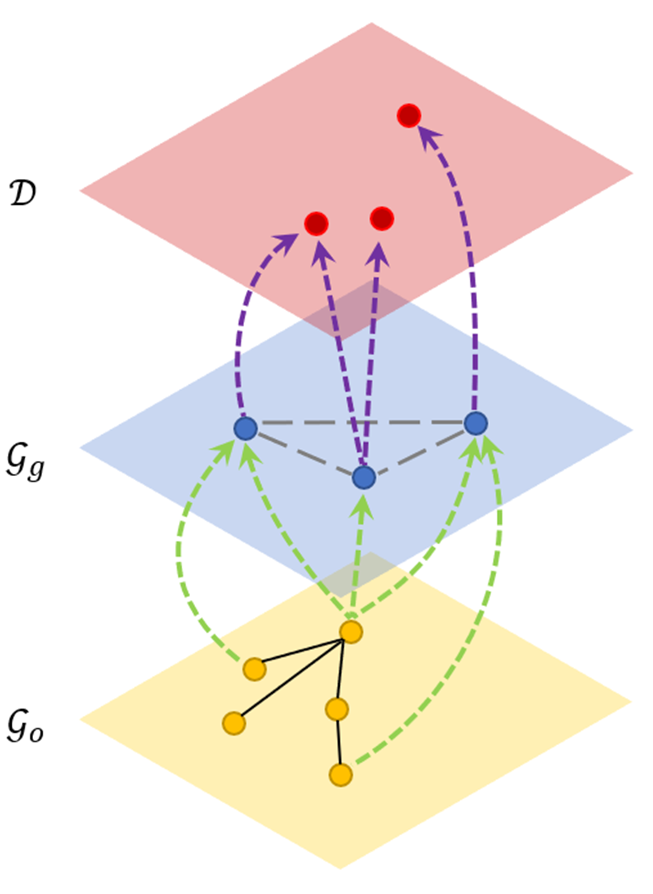
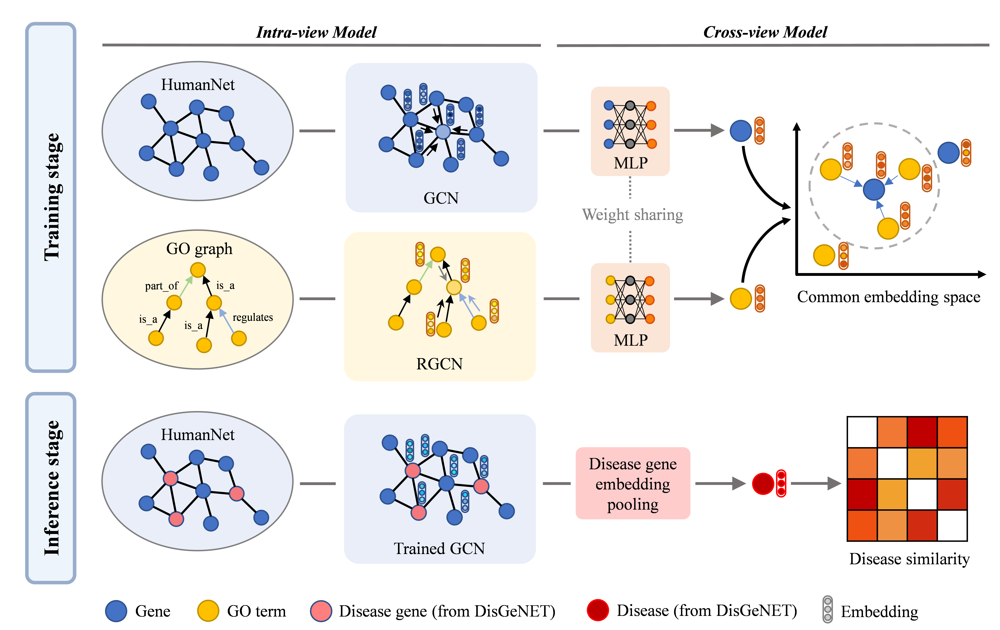
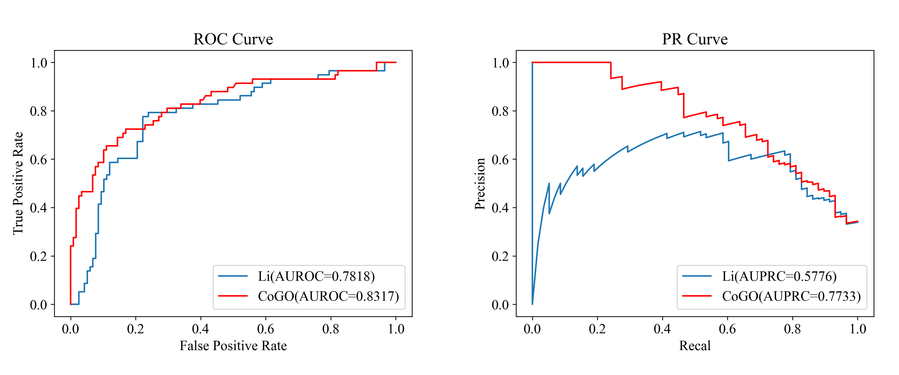

# CoGO


Codes and models for the paper "CoGO: a contrastive learning framework to predict disease similarity based on gene network and ontology structure".
> **To Cite:** \
> Yuhao Chen<sup>#</sup>, Yanshi Hu<sup>#</sup>, Xiaotian Hu, Cong Feng, Ming Chen<sup>*</sup> (2022). CoGO: a contrastive learning framework to predict disease similarity based on gene network and ontology structure. _**Bioinformatics**_, 38(18), 4380-4386.

Contact: mchen@zju.edu.cn. Any questions or discussions are welcome!

## Abstract

**Motivation:** Quantifying the similarity of human diseases provides guiding insights to the discovery of micro-scope mechanisms from a macro scale. Previous work demonstrated that better performance can be gained by integrating multi-view data sources or applying machine learning techniques. However, designing an efficient framework to extract and incorporate information from different biological data using deep learning models remains unexplored.

**Results:** We present **CoGO**, a **Co**ntrastive learning framework to predict disease similarity based on **G**ene network and **O**ntology structure, which incorporates the gene interaction network and gene ontology (GO) domain knowledge using graph deep learning models. First, graph deep learning models are applied to encode the features of genes and GO terms from separate graph structure data. Next, gene and GO features are projected to a common embedding space via a non-linear projection. Then cross-view contrastive loss is applied to maximize the agreement of corresponding gene-GO associations and lead to meaningful gene representation. Finally, CoGO infers the similarity between diseases by the cosine similarity of disease representation vectors derived from related gene embedding. In our experiments, CoGO outperforms the most competitive baseline method on both AUROC and AUPRC, especially improving 19.57% in AUPRC (0.7733). Furthermore, we conduct a detailed case study of top similar disease pairs demonstrated by other studies. Empirical results show that CoGO achieves powerful performance in disease similarity task.

## Introduction

1. We convert disease similarity prediction problem to multi-view graph representation learning problem.
   <div align="center"></div>
   <div align="center"><strong>An example of multi-view network</strong></div>

2. We propose to incorporate the disease-related molecular data and GO domain knowledge into disease similarity prediction problem. A contrastive learning-based method is presented to learn their correlations. 
   <div align="center"></div>
   <div align="center"><strong>Overview of CoGO architecture</strong></div>
   <br>
   In the training stage, GCN and RGCN are implemented to encode features of gene interaction network and GO graph. MLP is applied to map the output of GCN and RGCN to the coembedding space. Contrastive loss is used to maximize the agreement of corresponding genes and GO terms. In the inference stage, only trained GCN is preserved to calculate the gene embedding. Disease representation is derived from related gene embedding by average pooling.

3. The proposed CoGO model achieves state-of-the-art performance in manual inspection data sets, especially using Area Under Precision-Recall Curve (AUPRC) as evaluation metric. 
   > We evaluate the disease similarity prediction performance using both AUROC and AUPRC. This is because ROC curves can present an overly optimistic view of an algorithm's performance when applied to imbalanced data sets.
   <div align="center"></div>
   <div align="center"><strong>Performance of CoGO and previous SOTA method</strong></div>

## Using CoGO

This repository contains:
- Environment Setup
- Data Processing
- Training and Testing

### Environment Setup

> **Base environment:** \
> $\qquad$ python 3.8, cuda 11.1, pytorch 1.9.0, torchvision 0.10.0, tensorboard 2.8.0 \
> **pytorch-geometric:** \
> $\qquad$ pip install torch-scatter -f https://data.pyg.org/whl/torch-1.9.0+cu111.html \
> $\qquad$ pip install torch-sparse -f https://data.pyg.org/whl/torch-1.9.0+cu111.html \
> $\qquad$ pip install torch-geometric \
> **Other related package:** \
> $\qquad$ goatools 1.2.3

### Data Processing

The data processing codes in `./data/data_parser.py` including:
- **GOParser:** process GO data as knowledge graph and output triplets in the format of (source, relation, target). 
- **HNParser:** process HumanNet data as undirected weighted graph and output adjacency matrix. 
- **DGNParser:** process DisGeNET data as bipartite graph and output d2g matrix. Each row represents a disease and columns indicate their related genes.
- **gene2go related functions:** process gene-GO associations data from NCBI Gene database. 

### Training and Testing

Training codes in `./src/trainer.py` and the run script in `./src/run.py`.
Model will be tested on benchmark after training. 

```
"python -u run.py \
   --data={} \                     # path to dataset
   --h_dim={} \                    # dimension of layer h
   --z_dim={} \                    # dimension of layer z
   --tau={} \                      # softmax temperature
   --lr={} \                       # learning rate
   --epochs={} \                   # Train epochs
   --disable-cuda={} \             # disable CUDA
   --log-every-n-steps={} \        # log every n steps
   ".format(data, h_dim, z_dim, tau, lr, epochs, disable_cuda, log_every_n_steps)
```

### Dataset Download:

Gene Ontology (we use all three branches in go.obo file):
- http://purl.obolibrary.org/obo/go.obo

HumanNet (we use HumanNet-FN):
- https://www.inetbio.org/humannet/networks/HumanNet-FN.tsv

Gene-GO associations (we use NCBI gene2go annotation): 
- https://ftp.ncbi.nih.gov/gene/DATA/gene2go.gz

DisGeNET (we use all gene-disease associations):
- https://www.disgenet.org/downloads


> [!NOTE]
> All the datasets are compressed into `./data/raw.zip`
